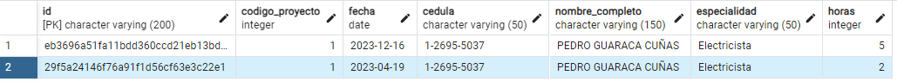

## Data Engineering Evaluation
## Adriana Priscila Arroyo Hernández 
### adrianapah10@gmail.com

### Tecnologies

The following technologies and tools were used to develop the test.

- Python 3.12
- Docker
- Postgressql

### Install packages

```bash
pip3 install sqlalchemy
pip install pandas
pip install psycopg2
```

### Run db

```bash
docker compose up
```

# PART I
You can find the code in EmployeeReport.ipynb

You must generate an internal procedure that creates a table for each project that includes employee and hours
dedicated (summary per day).
### Considerations 


For this part, I made the following considerations: 

- The name of the created table would be project_projectdescription, for example: **project**_construcción_bodegas_wallmart_cartago, this decision is made based on the fact that each project can be easily distinguished.

- For the primary key, an md5 hash is created, which takes the fecha and cedula to create it.


- To process the date, it was formatted to convert it to the AAA-MM-DD format because the data coming from the CSV was not the format that postgress accepts.


- For the name of the worker, I decided that instead of having a column for the first name and another for the last name, the first and last names would be merged into one, in my opinion the readability of the information is improved.


- In the CSV you could find duplicate information for the same day and project.


- To avoid duplication of data for the same day and project, the rows were combined to add the hours and thus have a single record per day.



- Because the document does not specify the columns that you want to be shown, I created the table with the columns that, in my opinion, make the report more understandable, including

1. id: Non-repeatable md5 hash
2. codigo_proyecto: To identify the project
3. fecha: Helps identify the day the hours were worked 
4. cedula: Identify the employee
5. nombre_completo: It makes the information more readable, since instead of searching by cedula, we have the direct name of the employee.  
6. horas: Allows you to view the number of hours that the employee dedicated to that project

Knowing all the previous considerations, the tables were as follows:

## Project 1 
Name: project_construcción_bodegas_wallmart_cartago


## Project 2 
Name: project_construcción_edificio_alpha_alajuela


## Project 3 
Name: project_remodelación_mall_desamparados


## Project 4 
Name: project_remodelación_museo_de_los_niños


# PART II

## Exercise 1 - Data Modeling
Create a data model for CarSalesDataforReports Excel spreadsheet (You can use a tool to design it or draw it and send a picture).
### Considerations

1. The following columns are taken for the primary keys of each table
- Clients: `ClientID`
- Colors: `ColorID`
- Countries: `CountryID`
- Stock: `StockID`
- Invoices: `InvoiceID`
- InvoiceLine: `InvoiceLineID`
- DateDimension: `DateKey`


2. The name of tables in excel are in plural, but for better performance in the database, I wrote the names in the singular form.

- Clients: `Client`
- Colors: `Color`
- Countries: `Country`
- Stock: `Stock`
- Invoices: `Invoice`
- InvoiceLines: `InvoiceLine`
- DateDimension: `DateDimension`

3. The variables have been written with the first word with a capital letter, I wrote the variables in camelCase, for use a standard. Also, I added types as integer, varchar, and date, also I made restrictions, such as the length of the words.


### Read Cardinalities 


Each STOCK may have at most one COLOR.
Each COLOR may have one or more STOCK.

## Conceptual data model 


## Logical data model 


## Exercise 2 - Object Oriented Programming

1. You can find the solution in CarSalesDataObjects.ipynb 
- For this part, I decided to create a class for every table with a method that receives the attributes and a method that shows the created object.


2. Based on the point number one, define a class to include another kind of transportation vehicle. Include
properties and methods that you consider required.

- For this part, I decided to create a new air transport


## Exercise 3 - Queries
 - You can find the solution in CarSalesDataQueries.ipynb 

 - The same config file was used to make it easier to change the route if necessary and the excel sheets were read.


- To obtain the date and perform the quarter division, the InvoiceDateKey field is converted to a string and then separate the year and month


1. Create a query that returns the top 3 car brands most sold (i.e., having the most car brand sales) during first and third quarter of year 2015.

For this query, the invoices were joined with invoice_line and the result was joined with stock, this is the result of the query. 


2. Create a query that shows the top 3 most sold car colors (i.e., having the most car color sales) for each quarter for the years 2012,2013,2014,2015.

For this query, the invoices were joined with invoice_line and the result was joined with stock, and the result was joined with Colors, this is the result of the query. 

